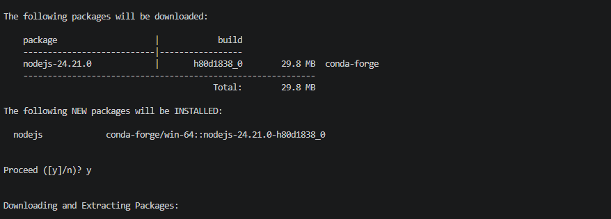
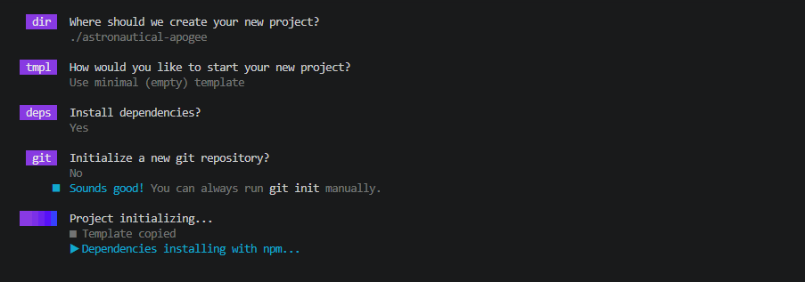

# astro-firebase-mockblog
Quick small project to get familiarized with Astro and firebase


# Summary
Along the way, I've done

- Setup repo, test branch, first commit [10/10/2026]


# High level steps

## Setting up env

### Managing node with conda

- Created conda env with even num versioned nodejs
```
$path> conda create -n myastroenv nodejs=24
```



- Activated  ennv
```
$path> conda activate myastroenv
```

### Installed/Launched Astrojs

- Updated npm just to be safe :)
```
$path> npm install -g npm

$path> npm create astro@latest
```



